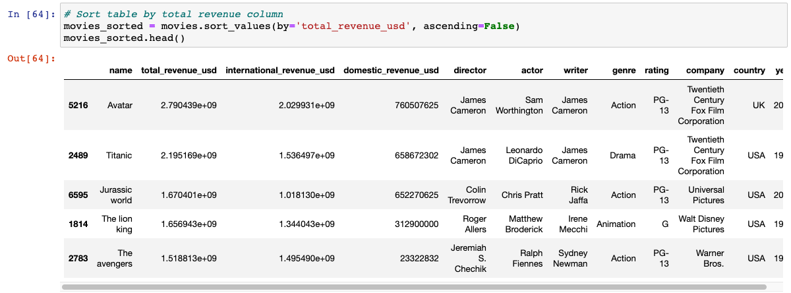
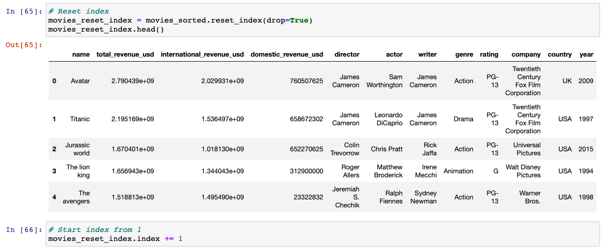
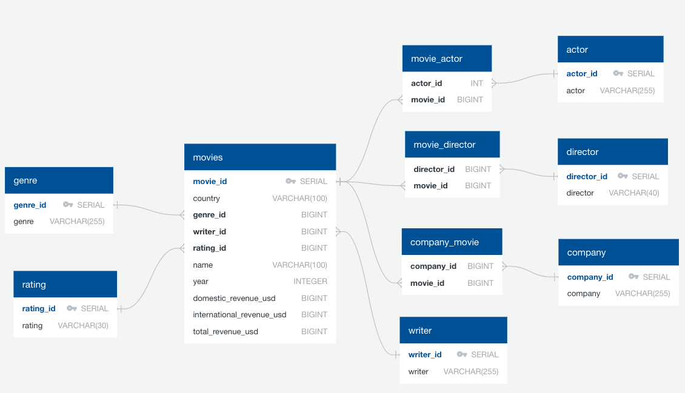
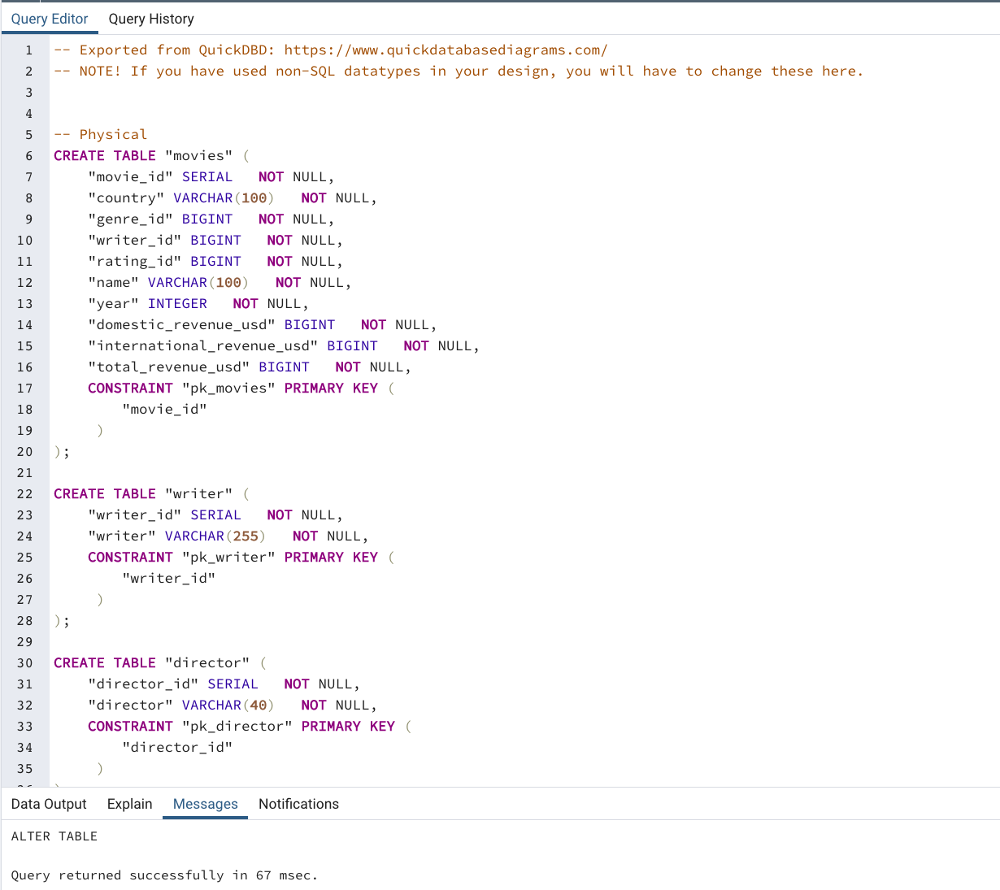
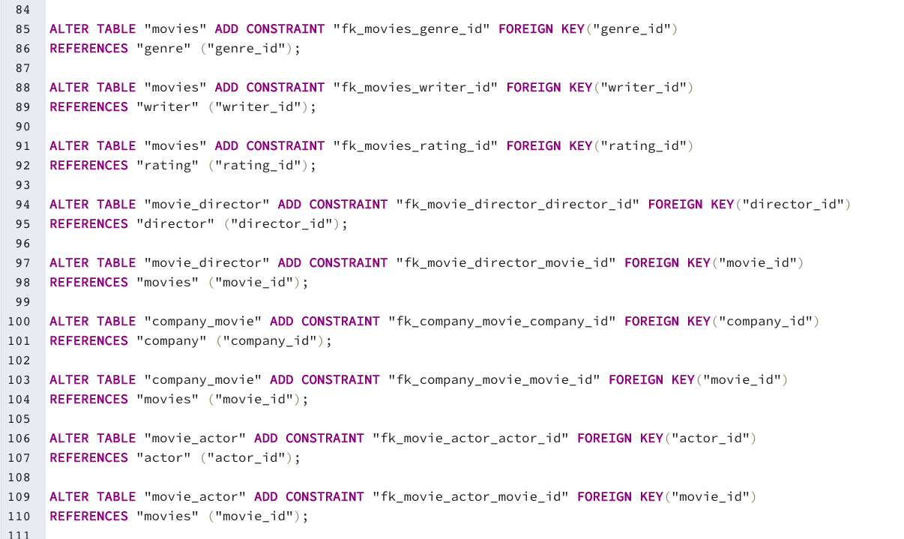

# Group 7 ETL Project Report

This is the report on the Group 7 ETL project. 

## Extract:

The premise of our ETL project take a movie dataset that contained three decades of movie data from 1986-2016 from Kaggle and build upon it with another set of data.  The original Kaggle data set contained 15 columns of information, but regarding box office revenue it only contained the domestic box office revenue.  We decided that our second source of data should have the international or total box office revenue for each movie so we could merge that data into our .csv downloaded from Kaggle (movies.csv).  We created a for loop to web scrape the total (domestic + international) box office revenue for 10,000 movies from Box Office Mojo.
Two data sources were used to collect the required data

* [Kaggle](https://www.kaggle.com/danielgrijalvas/movies?select=movies.csv) 

* [BoxOfficeMojo](https://www.boxofficemojo.com/chart/top_lifetime_gross/?area=XWW)

Note that the loop code needs to be adjusted for Mac or Windows users, and the location of your chromedriver.exe path. 

### Transform:

We then cleaned our data inside the scrape_final.ipynb file and prepared it for export into SQL.  This involved dropping any duplicate data, changing datatypes of certain columns into integer or datetime format, and much more organizational steps.  Instructors or graders of this project will need to run the scrape_final.ipynb file from top to bottom. Instructions are included in the file, along with all steps taken to clean the data.

* Duplication Drop Preparation:
 

* Currency to Numeric:
 

* Merging domestic and total revenue tables. And perform the following to transform the data.
The first step is to do a Left join on the two tables since we are only concerned about expanding our original Kaggle dataset with movies from 1986-2016 (The data that was scraped from Box Office Mojo contains 10,000 movies, some of which are before 1986 and after 2016) to create a combined_gross_info table. Since we have gathered data for domestic & total box office revenue for each movie, we can now calculate the international box office revenue. 

The movies without strinng matches (2362/7040) had null values that we had to convert to numeric 0 for sorting later on (because when sorted in DESC order, Null appears on top).

We then dropped columns that weren’t necessary for our project and sorted the movies based on total_revenue_usd (Global Box Office Revenue) in one step, and saved the new table as ‘movies’.

We've generated a physical schema using online QuickDBD tool. This tool allows postgreSQL SQL script to be exported as a file, which can be loaded directly to postgreSQL and run to generate the tables and the relationships.
The ERD looks as follows:

Once the ETL_Final.ipynb file is completed, it will stop before pushing tables' data to postgreSQL.
The SQL code will look as follows and it will first create the necessary tables with associated columns and their data types:

When tables are generated the sql script will update the tables and columns with the constraints.

After sql script is run, you need to return to the ETL_Final.ipynb file and complete the last part of loading as below. 

### Load:

Our database is movies_dB which contains the following tables:
* Movies
* Director
* Actor
* Writer
* Company
* Genre
* Rating
* Actor_Movie
* Director_Movie
* Company_Movie

The actor_movie, director_movie, and company_movie tables are in place to connect the actor, director, and company tables to the movies table (main table). One idea we were going to implement was rank columns for actors, directors, and companies.  The rank would be determined by sum of the actors, directors, or companies total_revenue_usd.  Unfortunately, we were restricted on time and this would surpass the ETL process, but gives a good idea of where how the foundation of our data could be used.
